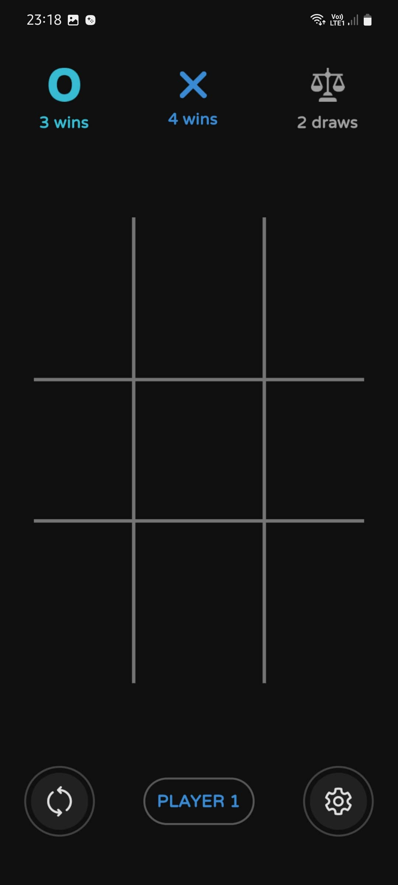
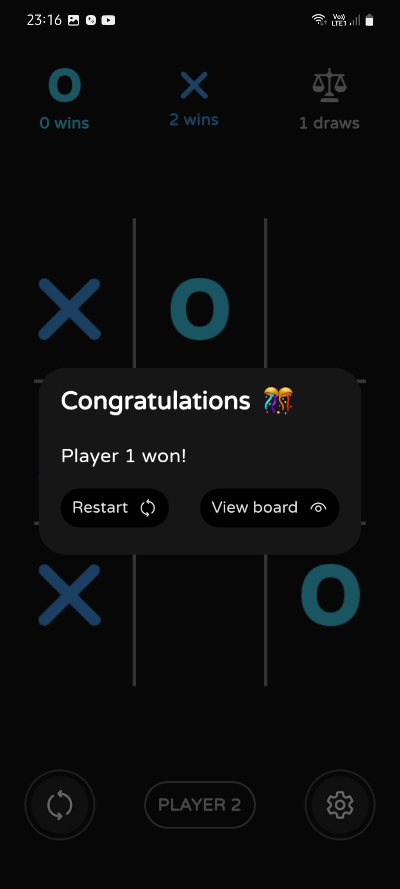
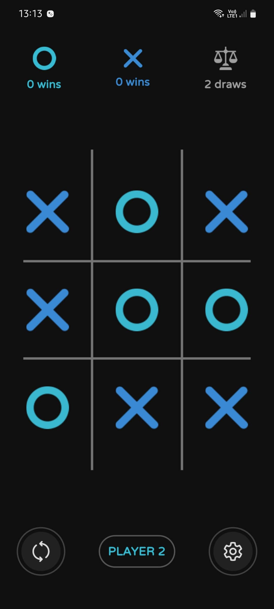
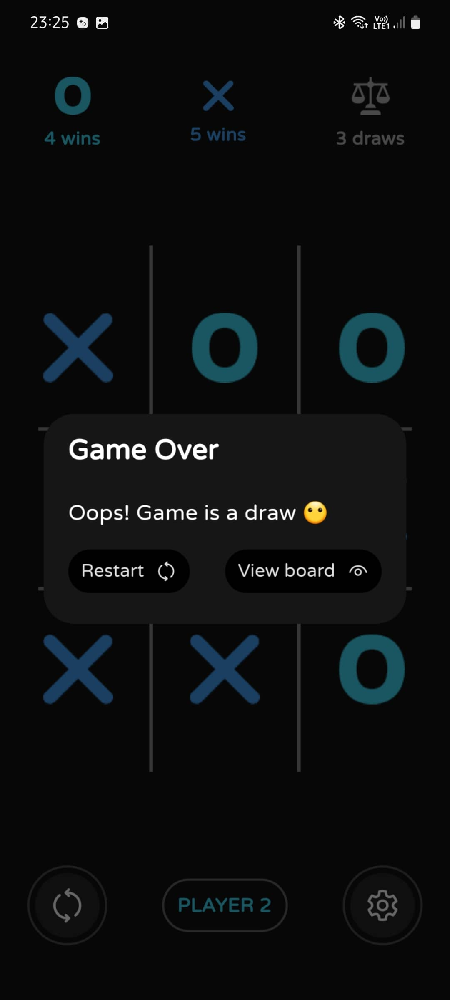
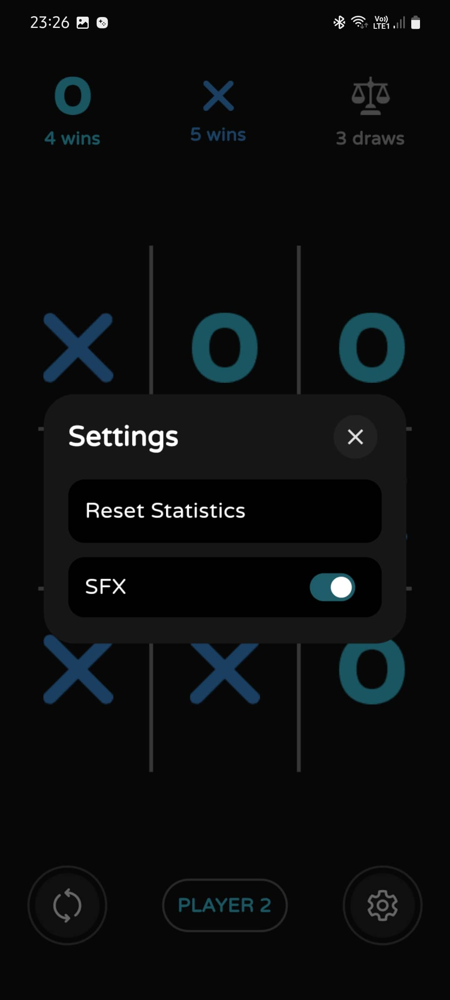

# Tic Tac Toe Game

This is a simple Tic Tac Toe game developed in Flutter. It allows two players to take turns and compete against each other to achieve three consecutive marks in a row, column, or diagonal on a 3x3 grid. The game includes a basic user interface and logic to determine the winner or a draw.

### Project Structure
 #### The project structure is organized in the following way:

* lib: contains the main Dart code for the application
* pages: contains the main UI screen
* widgets: contains components used throughout the app.
* assets: contains assets used in app such as images, audio etc

## Features
* Two-player gameplay: Play against a friend on the same device.
Interactive UI: Tap on the grid cells to place your mark (either "X" or "O").
* Win detection: The game automatically detects when a player achieves three consecutive marks in a row, column, or diagonal and declares them as the winner.
* Draw detection: If all the cells are filled without a winner, the game declares it as a draw.
Reset: Reset the game board to start a new game.

### Installation
#### Clone the repository using the following command:
```bash
git clone https://github.com/iamkartiknayak/Flutter_TIC_TAC_TOE.git
```
#### Navigate to the project directory:
```bash 
cd whatsapp-clone-flutter
```
#### Install the dependencies:
```bash 
flutter pub get
```
#### Run the application:
```bash 
flutter run
```

### Usage
* Launch the application on your device/emulator.
* The game board will be displayed with an empty grid.
* Player 1 starts by tapping on any empty cell to place their mark ("X").
* Player 2 then takes their turn by tapping on another empty cell to place their mark ("O").
* Players continue taking turns until one of the following occurs:
* A player achieves three consecutive marks in a row, column, or diagonal, and they are declared as the winner.
* All cells are filled without a winner, resulting in a draw.
* To start a new game, press the reset button.

### Screenshots
&nbsp;&nbsp;&nbsp;&nbsp;&nbsp;&nbsp;&nbsp;&nbsp;&nbsp;
&nbsp;&nbsp;&nbsp;&nbsp;&nbsp;&nbsp;&nbsp;&nbsp;&nbsp;
<br><br>
&nbsp;&nbsp;&nbsp;&nbsp;&nbsp;&nbsp;&nbsp;&nbsp;&nbsp;
<br><br>

### License
This project is licensed under the MIT License.

### Acknowledgements
The development of this Tic Tac Toe game was inspired by the desire to learn and explore Flutter. Special thanks to the Flutter community for their valuable resources.

Happy gaming!
